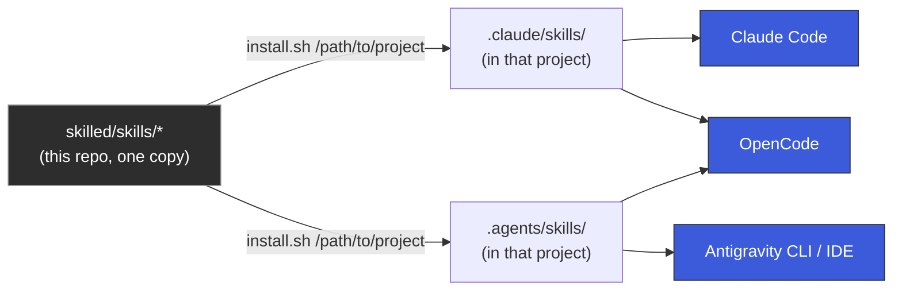
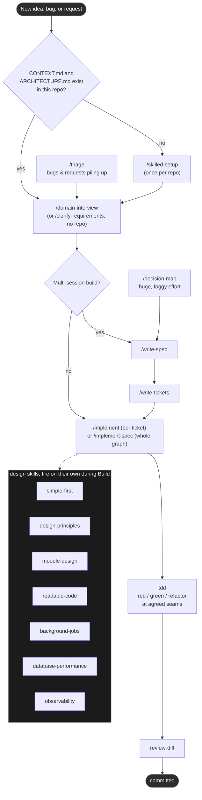

# skilled

Agent skills for building software: alignment before code, design discipline while writing it, and review before it ships.

## How it works

Two things happen independently: **installing** puts the skill files where an agent can find them; **using** them is just working normally and letting the right one fire, or typing one by name.

### Install

Skills live once, here, and get symlinked into whichever project you point `install.sh` at. Nothing is copied, so a `git pull` in this repo updates every project that has it installed.



`.claude/skills/` is Claude Code's native location; OpenCode reads it too. `.agents/skills/` is Antigravity's project scope; OpenCode reads that as well, so it's covered from either side. See [Supported harnesses](#supported-harnesses) for the one behavioral gap this creates.

### Use

Once installed, most of this runs itself: model-invoked skills (marked `[M]` below) fire on their own when the conversation matches their trigger. User-invoked skills (`[U]`) are typed, like `/skilled` or `/implement`. The typical path through a piece of work:



`/skilled` is the entry point when you forget any of this: it names every user-invoked skill and reports which project documents are missing. Read [CONVENTIONS.md](CONVENTIONS.md) for how the model-invoked/user-invoked split works and why one skill can call another.

## Install

```bash
git clone https://github.com/SonPhumrin/skilled.git ~/Documents/skilled   # or wherever you keep it
cd ~/Documents/skilled
./install.sh /path/to/your-project
```

That symlinks all 39 skills into `your-project/.claude/skills/` and `your-project/.agents/skills/`. Per-project, not global: a project you haven't pointed `install.sh` at never sees these skills, and running it against several projects is normal.

```bash
./install.sh /path/to/your-project --uninstall   # remove them from that project
```

Both are idempotent — safe to re-run after editing a skill, or after `git pull` picks up an update.

Verify the install landed correctly:

```bash
python3 tests/validate_skills.py --project /path/to/your-project
```

Then, inside that project, run `/skilled-setup` once. It writes `CONTEXT.md`, `ARCHITECTURE.md`, and the tracker config the workflow skills read. From there, `/skilled` is the thing to run when you're not sure what to reach for.

## Supported harnesses

Every skill here is a plain `SKILL.md` under the open [Agent Skills](https://agentskills.io) standard, so nothing is Claude-specific by construction.

| Harness | Reads from |
| :--- | :--- |
| Claude Code | `<project>/.claude/skills/` (native) |
| OpenCode | both `<project>/.claude/skills/` and `<project>/.agents/skills/` |
| Antigravity (CLI + IDE) | `<project>/.agents/skills/` (its project scope) |

**One real gap, not a bug**: `disable-model-invocation` (the field that keeps the 22 user-invoked skills out of the model's own reach) is a Claude Code extension. OpenCode and Antigravity both ignore unrecognized frontmatter keys per the open spec, so on those two harnesses every skill here is model-selectable, including the ones meant to be typed by hand. There is no portable "user-only" field in the standard today. See [tests/MANUAL-CHECKS.md](tests/MANUAL-CHECKS.md).

`~/.agents/skills/` (the *global*, home-directory version of that second path) is deliberately never touched: it is managed by the separate `npx skills` installer with its own lockfile, and this repo only ever writes the project-local `.agents/skills/` inside a specific repo, never the one in your home directory.

## Skills

`[U]` you type it. `[M]` the agent reaches for it on its own.

### Entry points

| Skill | |
| :--- | :--- |
| `skilled` `[U]` | Router. Names every skill here and when to reach for it. |
| `skilled-setup` `[U]` | Configure a repo: issue tracker, triage labels, domain docs. Once per repo. |
| `skilled-update` `[U]` | Check whether a ported skill has changed upstream, and show the diff. Never applies silently. |

### Alignment and planning

| Skill | |
| :--- | :--- |
| `clarify-requirements` `[U]` | Get interviewed on a plan until every branch of the design tree resolves. |
| `domain-interview` `[U]` | The same interview, sharpening `CONTEXT.md` and ADRs as it goes. |
| `requirements-interview` `[M]` | The interview primitive other skills call. |
| `domain-modeling` `[M]` | Build and sharpen domain terms by challenging them against scenarios. |
| `write-spec` `[U]` | Turn this conversation into a spec on the issue tracker. |
| `write-tickets` `[U]` | Break a plan into tracer-bullet tickets with blocking edges declared. |
| `decision-map` `[U]` | Plan large work as a map of decision tickets, resolved one at a time. |

### Build

| Skill | |
| :--- | :--- |
| `implement` `[U]` | Build one ticket from a spec, driving `tdd` at agreed seams, closing with `review-diff`. |
| `implement-spec` `[U]` | Build a whole spec on one branch: tickets as a task graph, implementer subagents across the ready frontier, one PR. |
| `tdd` `[M]` | Red, green, refactor. |
| `prototype` `[M]` | Throwaway build to answer a design question. |
| `research` `[M]` | Investigate against primary sources, capture as a cited file. |
| `diagnose-bug` `[M]` | Build a loop that goes red on the bug, then minimise, hypothesise, instrument, fix. |

### Design and quality

| Skill | |
| :--- | :--- |
| `simple-first` `[M]` | How much to build at all. The over-engineering guard. |
| `design-principles` `[M]` | Cohesion and coupling, Law of Demeter, CQS, composition, fail fast. |
| `module-design` `[M]` | Deep modules, seams, adapters, SOLID. |
| `readable-code` `[M]` | Naming, function shape, control flow, comments. |
| `background-jobs` `[M]` | Queues, idempotency, retries, dead-letter queues, the outbox pattern. |
| `database-performance` `[M]` | Indexes, N+1, pagination, pooling, transactions. |
| `observability` `[M]` | What to log, what to measure, what to trace. |
| `review-diff` `[M]` | Two-axis review of the diff: standards and spec. |
| `architecture-review` `[U]` | Scan a codebase for deepening opportunities, then work the one you pick. |
| `enforce-module-boundaries` `[U]` | Wire dependency-cruiser so package internals are unreachable from outside. TypeScript. |

### Workflow and ops

| Skill | |
| :--- | :--- |
| `triage` `[U]` | Move issues through the triage state machine. |
| `handoff` `[U]` | Compact this conversation into a handoff document. |
| `handoff-to-agent` `[U]` | Same summary, but launches a background agent with it instead of saving a file. |
| `retro` `[U]` | Review a finished session and propose fixes to the agent environment. |
| `design-workflows` `[U]` | Design specs for the recurring workflows you want to automate. |
| `teach` `[U]` | Teach a concept across sessions, using the working directory as state. |
| `write-questionnaire` `[U]` | Turn a decision you cannot make alone into a questionnaire. |
| `explain-again` `[U]` | Fire it the moment a message does not land. |
| `git-guardrails` `[U]` | Install a hook that blocks destructive git commands. |
| `setup-pre-commit` `[U]` | Scaffold pre-commit hooks. |
| `resolve-merge-conflicts` `[M]` | Work a merge or rebase hunk by hunk, resolving by intent. |
| `generate-runbook` `[M]` | Interactive bash script for steps only a human can perform. |
| `writing-for-agents` `[M]` | How to write skills and `CLAUDE.md`. |

## Using it effectively

The skills are not a menu you pick from independently — most of the value comes from letting them chain, since each one hands off state to the next (a spec, a ticket, a diff) instead of you re-explaining context every time. Two habits make that work:

1. **Don't skip `/skilled-setup`.** Everything downstream — `/domain-interview`, `/implement`, `/review-diff` — reads `CONTEXT.md` and `ARCHITECTURE.md` for domain terms and constraints. Skip it and those skills either ask you the same questions from scratch or guess.
2. **Stay in one context window from interview through tickets.** `/domain-interview` → `/write-spec` → `/write-tickets` build on the same reasoning; splitting them across sessions loses the "why" behind each ticket. `/implement` is the one place you *should* start fresh per ticket — that's by design, so each build isn't dragging the whole planning conversation's context with it.

When you don't remember which skill fits, type `/skilled` — it reads your repo's state and tells you.

### Worked example: shipping a feature

Say you're adding rate limiting to an API, in a repo that already has `CONTEXT.md` and `ARCHITECTURE.md` (from a prior `/skilled-setup`).

```
> /domain-interview
  add per-user rate limiting to the public API
```
The interview pins down what "rate limiting" means here before any code exists: fixed window or token bucket, per-user or per-API-key, what happens to the 429 response, whether limits are configurable per plan. Answers get written into `CONTEXT.md` (new terms) and an ADR if the approach is non-obvious. You skip this and `/implement` will guess "reasonable defaults" that may not be yours.

```
> /write-spec
```
Turns the interview into a spec on your issue tracker — the single source of truth `/write-tickets` and `/implement` both read from.

```
> /write-tickets
```
Splits the spec into tracer-bullet tickets with blocking edges declared, e.g. "add token-bucket store" blocks "wire middleware" blocks "add 429 response + headers." Small enough each survives one `/implement` pass; ordered enough `/implement-spec` can compute what's ready to build in parallel.

```
> /implement RATE-142
```
Builds one ticket. It drives `tdd` at the seams you agreed in the interview (red → green → refactor), and while it writes code, model-invoked skills fire on their own without you calling them: `simple-first` pushes back if the implementation reaches for a queue when an in-memory counter would do; `database-performance` flags an unindexed lookup if the bucket store hits Postgres per request; `observability` asks what gets logged when a user gets throttled. Before it lets you commit, `review-diff` checks the diff against both your team's standards and the ticket's actual spec — not just "does it run," but "does it do what RATE-142 said."

```
> /implement-spec
```
Alternative to running `/implement` per ticket one at a time: this reads the whole ticket graph, runs implementer subagents across every ticket whose blockers are already done, and lands the result as one PR. Reach for it when the graph is wide (several independent tickets) and you'd rather not babysit each one; use per-ticket `/implement` when you want to review as you go.

If a bug shows up later — say the limiter double-counts under concurrent requests — that's `diagnose-bug` territory, either invoked directly or triggered by describing the symptom; it insists on one reproducible failing case before it lets you theorize about the cause. If issues like this pile up faster than you can single-thread them, `/triage` moves each one through the same "is this actually ready to hand an agent" gate that `/write-tickets` applies to planned work, so both paths converge on the same shape of ticket.

### Other entry points worth knowing

- **No repo yet, or a plan that isn't tied to code** → `/clarify-requirements` instead of `/domain-interview`: same interview, no `CONTEXT.md`/ADR paper trail.
- **A question you need to *feel*, not reason about** (a state machine, a UI layout) → let `prototype` build a throwaway answer, then `/handoff` the finding back into the main interview.
- **An effort too foggy to scope in one sitting** → `/decision-map` charts it as a map of decision tickets resolved one at a time, then hands off to `/write-spec` once the fog clears. Slower than the main flow — reserve it for genuine fog, not a well-scoped feature that's merely large.
- **A session went badly** → `/retro` afterward proposes fixes to your *environment* (a missing doc, a check that should've been automated), not the code.
- **A message didn't land** → `/explain-again`, on the spot, re-pitches what was just said in plain English.

Full skill-by-skill reference is in the [Skills](#skills) table below; `skills/skilled/SKILL.md` is the router's own source if you want the exact decision logic.

## Adding a skill

Read [CONVENTIONS.md](CONVENTIONS.md) first. The two rules that matter most: pick model-invoked or user-invoked deliberately, and do not state a rule that another skill already owns.

## Project documents

`/skilled-setup` writes three documents into a repo, and every other skill reads them:

- **`CONTEXT.md`** - the domain language. Terms defined exactly, with the synonyms that must not be used.
- **`ARCHITECTURE.md`** - the runtime shape, plus **Constraints** and **Non-goals**. Non-goals is what lets an agent decline to build something instead of guessing.
- **`docs/adr/`** - one record per non-obvious decision, so it does not get silently re-litigated.

The seed templates live in [`skills/skilled-setup/`](skills/skilled-setup/).

