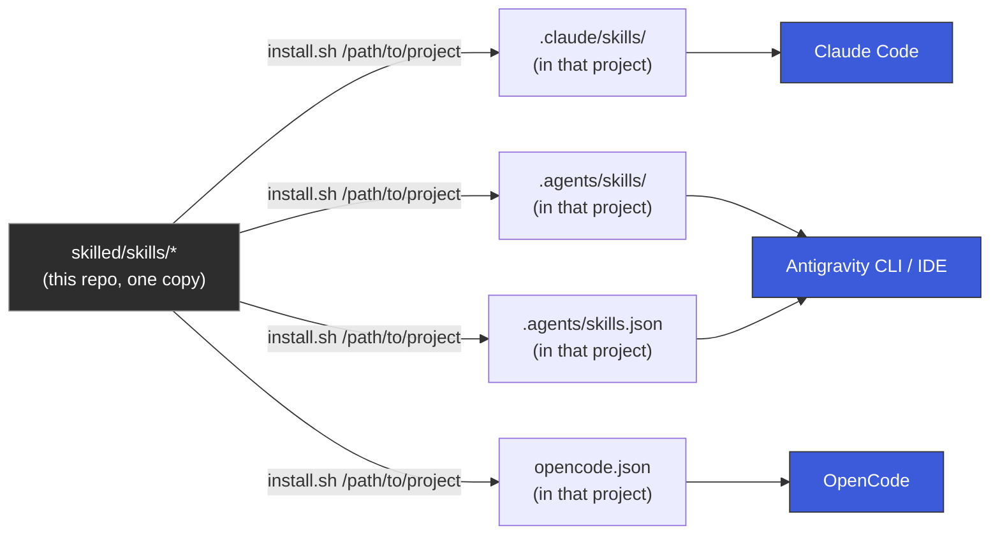
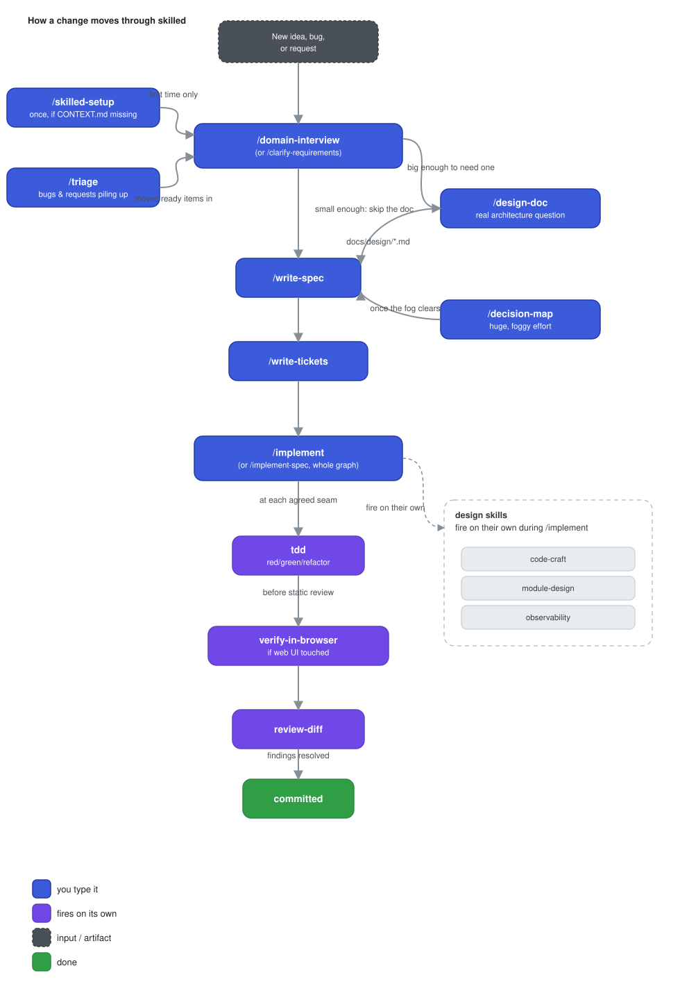
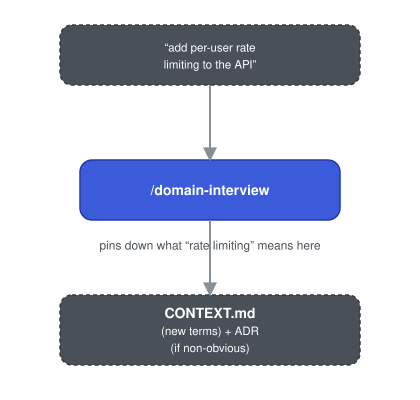
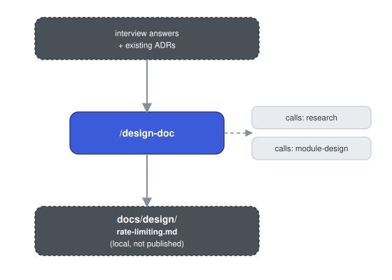
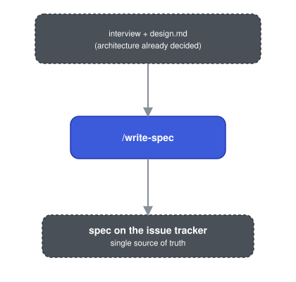
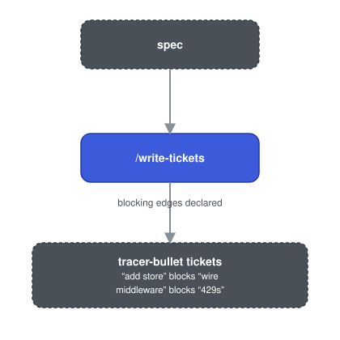
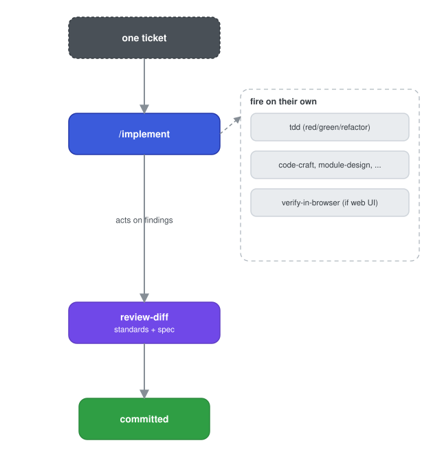
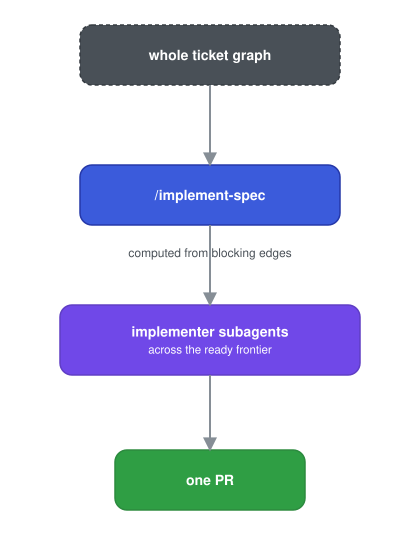

# skilled

Agent skills for building software: alignment before code, design discipline while writing it, and review before it ships.

This repo also holds **[UnSkilled](apps/unskilled/README.md)**, a minimal desktop app for Windows, macOS, and Linux that runs Claude with these skills built in: the workflow skills sit in its `/` menu, and the agent loads the rest on its own. The skills below work without it, in Claude Code, Codex, OpenCode, Antigravity, or deepseek-harness.

## How it works

Two things happen independently: **installing** puts the skill files where an agent can find them; **using** them is just working normally and letting the right one fire, or typing one by name.

### Install

Skills live once, here, and get symlinked into whichever project you point the installer at. Nothing is copied, so a `git pull` in this repo updates every project that has it installed. The installer is standard-library Python (`install.py`, with `install.sh` as a thin wrapper), so it runs the same on Linux, macOS, and Windows.



`.claude/skills/` is Claude Code's native project scope. Antigravity reads `.agents/skills/` as its native project scope too, plus `.agents/skills.json` as a documented fallback, since its directory scan has been observed going stale on a symlinked folder. OpenCode (v1.18.30+) also discovers project `.claude/skills`, `.agents/skills`, and `.opencode/{skill,skills}` natively — but `install.sh` registers this repo into the project's `opencode.json` `"skills": {"paths": [...]}` entry too, as a belt-and-suspenders addition: it's still what makes skills visible for an `--opencode`-only symlink install, or a project that has disabled native discovery. See [Supported harnesses](#supported-harnesses) for the harness-by-harness detail.

### Use

Once installed, most of this runs itself: model-invoked skills fire on their own when the conversation matches their trigger. User-invoked skills are typed, like `/skilled` or `/implement`. The typical path through a piece of work:

<p align="center"></p>

`/skilled` is the entry point when you forget any of this: it names every user-invoked skill and reports which project documents are missing. Read [CONVENTIONS.md](CONVENTIONS.md) for how the model-invoked/user-invoked split works and why one skill can call another.

## Install

```bash
git clone https://github.com/SonPhumrin/skilled.git ~/Documents/skilled   # or wherever you keep it
cd ~/Documents/skilled
./install.sh /path/to/your-project
```

On Windows, run `python install.py C:\path\to\your-project` instead; every flag below is the same.

With no flags, that installs for Claude Code, OpenCode, and Antigravity (see [Supported harnesses](#supported-harnesses)). Pass one or more of `--claude`, `--opencode`, `--antigravity`, `--codex`, `--dsh` to install only for the ones a given project actually uses:

```bash
./install.sh /path/to/your-project --claude              # Claude Code only
./install.sh /path/to/your-project --claude --antigravity # skip OpenCode's opencode.json
./install.sh /path/to/your-project --codex               # Codex CLI (.agents/skills)
```

Driving the project from a harness that serves the user-invoked skills itself (see [HARNESS.md](HARNESS.md))? Add `--model-only` to install just the 15 model-invoked skills; the other 23 then cost no context on any agent.

Per-project, not global: a project you haven't pointed `install.sh` at never sees these skills, and running it against several projects is normal.

```bash
./install.sh /path/to/your-project --uninstall             # remove everything this wrote
./install.sh /path/to/your-project --uninstall --opencode  # remove just the OpenCode entry
```

Both are idempotent — safe to re-run after editing a skill, or after `git pull` picks up an update.

Where symlinks aren't available (Windows without Developer Mode, some network drives), each skill is copied instead and the installer says so; re-run it after `git pull` to resync.

By default, every skill is a **symlink** back into this repo — `git pull` here updates every project instantly, but only on the machine that ran the install: a coworker cloning your project gets a dead symlink, since it points at an absolute path on your disk. If the project is shared, add `--vendor` to copy real files in instead:

```bash
./install.sh /path/to/your-project --vendor
```

Vendored skills are self-contained and `git add`-able — anyone who clones the project gets working skills with no separate checkout of this repo. The trade-off is the one every vendored dependency has: it goes stale. Re-run `--vendor` after this repo updates to resync; `validate_skills.py --project` (below) flags a vendored copy that's drifted from the source.

Verify the install landed correctly:

```bash
python3 tests/validate_skills.py --project /path/to/your-project
```

Then, inside that project, run `/skilled-setup` once. It writes `CONTEXT.md`, `ARCHITECTURE.md`, and the tracker config the workflow skills read. From there, `/skilled` is the thing to run when you're not sure what to reach for.

## Supported harnesses

Every skill here is a plain `SKILL.md` under the open [Agent Skills](https://agentskills.io) standard, so nothing is Claude-specific by construction.

| Harness | Reads from |
| :--- | :--- |
| Claude Code | `<project>/.claude/skills/` (native) |
| Antigravity (CLI + IDE) | `<project>/.agents/skills/` (native) + `<project>/.agents/skills.json` (its own documented external-registration fallback, since the native scan can miss a symlinked folder) |
| Codex CLI | `<project>/.agents/skills/` (native). User-invoked skills carry `agents/openai.yaml` with `allow_implicit_invocation: false`, Codex's own way of keeping a skill out of the model's catalog |
| deepseek-harness | `<project>/.agents/skills/` (native); honors `disable-model-invocation` |
| Your own harness | `skills.json` + the contract in [HARNESS.md](HARNESS.md) |
| OpenCode | `<project>/opencode.json`'s `"skills": {"paths": [...]}` entry, written as a belt-and-suspenders addition — current OpenCode (v1.18.30+) also discovers project `.claude/skills`, `.agents/skills`, and `.opencode/{skill,skills}` natively, but this registration still matters for `--opencode`-only symlink installs and for projects with native discovery disabled |

**Two real gaps, not bugs**: `disable-model-invocation` (the field that keeps the 23 user-invoked skills out of the model's own reach) is honored by Claude Code and deepseek-harness, and Codex gets the same effect from `agents/openai.yaml`. OpenCode and Antigravity ignore it, so there every skill here is model-selectable, including the ones meant to be typed by hand. There is no portable "user-only" field in the standard today; a harness that follows [HARNESS.md](HARNESS.md) closes the gap by installing with `--model-only` and serving the user-invoked skills itself.

Separately, OpenCode's project-level skill discovery isn't a directory scan at all — it's config-driven (`opencode.json`), which `install.sh` handles automatically, but a hand-edited or `.jsonc` config in that project needs the `skills.paths` entry added by hand (`install.sh` will tell you the exact line if it can't edit it for you). See [tests/MANUAL-CHECKS.md](tests/MANUAL-CHECKS.md).

`~/.agents/skills/` (the *global*, home-directory version of that second path) is deliberately never touched: it is managed by the separate `npx skills` installer with its own lockfile, and this repo only ever writes the project-local `.agents/skills/` inside a specific repo, never the one in your home directory.

## Skills

`[U]` you type it. `[M]` the agent reaches for it on its own.

### Entry points

| Skill | |
| :--- | :--- |
| `skilled` `[U]` | Router. Names every skill here and when to reach for it. |
| `skilled-setup` `[U]` | Configure a repo: issue tracker, triage labels, domain docs. Once per repo. |
| `skilled-update` `[U]` | Check whether a ported skill has changed upstream, and show the diff. Never applies silently. |

### Alignment and planning

| Skill | |
| :--- | :--- |
| `clarify-requirements` `[U]` | Get interviewed on a plan until every branch of the design tree resolves. |
| `domain-interview` `[U]` | The same interview, sharpening `CONTEXT.md` and ADRs as it goes. |
| `requirements-interview` `[M]` | The interview primitive other skills call. |
| `domain-modeling` `[M]` | Build and sharpen domain terms by challenging them against scenarios. |
| `design-doc` `[U]` | Research and write a pre-spec architecture doc, for work big enough to need one. |
| `write-spec` `[U]` | Turn this conversation into a spec on the issue tracker. |
| `write-tickets` `[U]` | Break a plan into tracer-bullet tickets with blocking edges declared. |
| `decision-map` `[U]` | Plan large work as a map of decision tickets, resolved one at a time. |

### Build

| Skill | |
| :--- | :--- |
| `implement` `[U]` | Build one ticket from a spec, driving `tdd` at agreed seams, closing with `verify-in-browser` and `review-diff`. |
| `implement-spec` `[U]` | Build a whole spec on one branch: tickets as a task graph, implementer subagents across the ready frontier, one PR. |
| `tdd` `[M]` | Red, green, refactor; characterizes untested code before changing it. |
| `prototype` `[M]` | Throwaway build to answer a design question. |
| `research` `[M]` | Investigate against primary sources, capture as a cited file. |
| `diagnose-bug` `[M]` | Build a loop that goes red on the bug, then minimise, hypothesise, instrument, fix. |

### Design and quality

| Skill | |
| :--- | :--- |
| `code-craft` `[M]` | The senior-engineer judgment ladder: how much to build, cohesion/coupling/Demeter/CQS/composition/fail-fast, naming and function shape, data/system design (async, idempotency, retries, indexing, pagination, transactions), performance/concurrency, and security by default. |
| `module-design` `[M]` | Deep modules, seams, adapters, SOLID. |
| `observability` `[M]` | What to log, what to measure, what to trace. |
| `release-safety` `[M]` | Expand-contract migrations, version skew, flags, and a rollback plan, so a change is safe to deploy and to undo. |
| `verify-in-browser` `[M]` | Drive the app in a real browser to check a ticket's acceptance criteria, UI, and translations. |
| `review-diff` `[M]` | Two-axis review of the diff: standards and spec. |
| `architecture-review` `[U]` | Scan a codebase for deepening opportunities, then work the one you pick. |
| `enforce-module-boundaries` `[U]` | Wire dependency-cruiser so package internals are unreachable from outside. TypeScript. |

### Workflow and ops

| Skill | |
| :--- | :--- |
| `triage` `[U]` | Move issues through the triage state machine. |
| `handoff` `[U]` | Compact this conversation into a handoff document. |
| `handoff-to-agent` `[U]` | Same summary, but launches a background agent with it instead of saving a file. |
| `retro` `[U]` | Review a finished session and propose fixes to the agent environment. |
| `design-workflows` `[U]` | Design specs for the recurring workflows you want to automate. |
| `teach` `[U]` | Teach a concept across sessions, using the working directory as state. |
| `write-questionnaire` `[U]` | Turn a decision you cannot make alone into a questionnaire. |
| `explain-again` `[U]` | Fire it the moment a message does not land. |
| `git-guardrails` `[U]` | Install a hook that blocks destructive git, database, and infrastructure commands. |
| `setup-pre-commit` `[U]` | Scaffold pre-commit hooks. |
| `resolve-merge-conflicts` `[M]` | Work a merge or rebase hunk by hunk, resolving by intent. |
| `generate-runbook` `[M]` | Interactive script for steps only a human can perform. |
| `writing-for-agents` `[M]` | How to write skills and `CLAUDE.md`. |

## Using it effectively

The skills are not a menu you pick from independently — most of the value comes from letting them chain, since each one hands off state to the next (a spec, a ticket, a diff) instead of you re-explaining context every time. Three habits make that work:

1. **Size the work before picking a flow.** A change you can describe in one sentence goes straight to `/implement`, which takes its own small-change path. The full interview → spec → tickets flow is for work that needs it; on a one-line fix it costs more than it saves. `/skilled` asks which situation you're in.

2. **Don't skip `/skilled-setup`.** Everything downstream — `/domain-interview`, `/implement`, `/review-diff` — reads `CONTEXT.md` and `ARCHITECTURE.md` for domain terms and constraints. Skip it and those skills either ask you the same questions from scratch or guess.
3. **Stay in one context window from interview through tickets.** `/domain-interview` → `/write-spec` → `/write-tickets` build on the same reasoning; splitting them across sessions loses the "why" behind each ticket. `/implement` is the one place you *should* start fresh per ticket — that's by design, so each build isn't dragging the whole planning conversation's context with it.

When you don't remember which skill fits, type `/skilled` — it reads your repo's state and tells you.

### Worked example: shipping a feature

Say you're adding rate limiting to an API, in a repo that already has `CONTEXT.md` and `ARCHITECTURE.md` (from a prior `/skilled-setup`). Terminal on the left of each step is illustrative — the shape of what comes back, not a literal transcript — the diagram on the right is what actually moved.

```
$ claude
> /domain-interview
  add per-user rate limiting to the public API

  Fixed window or token bucket? Per-user or per-API-key? What happens
  on the 429 — reject, queue, degrade? Configurable per plan?
  ...
  → writes new terms into CONTEXT.md
  → opens docs/adr/0007-rate-limit-algorithm.md (undecided, flagged for /design-doc)
```

<p align="center"></p>

The interview pins down what "rate limiting" means here before any code exists: fixed window or token bucket, per-user or per-API-key, what happens to the 429 response, whether limits are configurable per plan. Answers get written into `CONTEXT.md` (new terms) and an ADR if the approach is non-obvious. Skip this and `/implement` will guess "reasonable defaults" that may not be yours.

Token bucket vs. fixed window, and where the bucket state lives, is a real architecture question — not something to leave to `/write-spec`'s "Implementation Decisions" section. Worth a design doc first:

```
> /design-doc

  reading CONTEXT.md, docs/adr/0007-rate-limit-algorithm.md...
  calling Skill "research" — how does the rate-limit store's client
    handle atomic increments?
  calling Skill "module-design" — token-bucket module vs. fixed-window,
    compared on depth and seam placement
  → docs/design/rate-limiting.md written
```

<p align="center"></p>

No arguments needed — it reads back through the interview you just had. It explores the repo (respecting `CONTEXT.md`/existing ADRs), calls the Skill tool with `"research"` for anything it needs to check, calls `"module-design"` to compare the two shapes, and writes the result to `docs/design/rate-limiting.md` — a local file, not published anywhere. For a new project instead of an existing feature, this is also where you'd hand it a UI framework, component-library CLI, or color scheme to record under "Technology & Framework Choices."

```
> /write-spec

  reading the interview + docs/design/rate-limiting.md...
  → RATE-142: "Per-user rate limiting" opened on the issue tracker
```

<p align="center"></p>

Turns the interview into a spec on your issue tracker — the single source of truth `/write-tickets` and `/implement` both read from. Since `docs/design/rate-limiting.md` exists, `/write-spec` reads it and references its architecture decisions instead of re-deriving them.

```
> /write-tickets

  splitting RATE-142 into tracer-bullet tickets...
  → RATE-143 add token-bucket store
  → RATE-144 wire middleware (blocked by RATE-143)
  → RATE-145 add 429 response + headers (blocked by RATE-144)
```

<p align="center"></p>

Splits the spec into tracer-bullet tickets with blocking edges declared. Small enough each survives one `/implement` pass; ordered enough `/implement-spec` can compute what's ready to build in parallel.

```
> /implement RATE-143

  tdd: red → green → refactor at the agreed seam
  code-craft: pushes back — a queue when an in-memory counter would do,
    and flags an unindexed lookup on the bucket table
  verify-in-browser: skipped, no web UI in this ticket
  review-diff: standards clean, spec matches RATE-143
  → committed
```

<p align="center"></p>

Builds one ticket. It drives `tdd` at the seams you agreed in the interview (red → green → refactor), and while it writes code, model-invoked skills fire on their own without you calling them: `code-craft` pushes back if the implementation reaches for a queue when an in-memory counter would do, and flags an unindexed lookup if the bucket store hits Postgres per request; `observability` asks what gets logged when a user gets throttled. If the ticket had touched a screen — say, a "requests remaining" indicator in the UI — `verify-in-browser` would drive it in a real browser first. Before it lets you commit, `review-diff` checks the diff against both your team's standards and the ticket's actual spec — not just "does it run," but "does it do what RATE-143 said."

```
> /implement-spec

  ready frontier: RATE-143 (no blockers)
  RATE-143 done → RATE-144 now ready → RATE-145 now ready
  → one PR opened covering RATE-143, RATE-144, RATE-145
```

<p align="center"></p>

Alternative to running `/implement` per ticket one at a time: this reads the whole ticket graph, runs implementer subagents across every ticket whose blockers are already done, and lands the result as one PR. Reach for it when the graph is wide (several independent tickets) and you'd rather not babysit each one; use per-ticket `/implement` when you want to review as you go.

If a bug shows up later — say the limiter double-counts under concurrent requests — that's `diagnose-bug` territory, either invoked directly or triggered by describing the symptom; it insists on one reproducible failing case before it lets you theorize about the cause. If issues like this pile up faster than you can single-thread them, `/triage` moves each one through the same "is this actually ready to hand an agent" gate that `/write-tickets` applies to planned work, so both paths converge on the same shape of ticket.

### Other entry points worth knowing

- **No repo yet, or a plan that isn't tied to code** → `/clarify-requirements` instead of `/domain-interview`: same interview, no `CONTEXT.md`/ADR paper trail.
- **A question you need to *feel*, not reason about** (a state machine, a UI layout) → let `prototype` build a throwaway answer, then `/handoff` the finding back into the main interview.
- **An effort too foggy to scope in one sitting** → `/decision-map` charts it as a map of decision tickets resolved one at a time, then hands off to `/write-spec` once the fog clears. Slower than the main flow — reserve it for genuine fog, not a well-scoped feature that's merely large.
- **A real architecture question, or a new project's stack/design-system to pin down** → `/design-doc` researches it and writes a local `design.md` before `/write-spec`; skip it for features whose implementation decisions fit in the spec itself.
- **A session went badly** → `/retro` afterward proposes fixes to your *environment* (a missing doc, a check that should've been automated), not the code.
- **A message didn't land** → `/explain-again`, on the spot, re-pitches what was just said in plain English.

Full skill-by-skill reference is in the [Skills](#skills) table below; `skills/skilled/SKILL.md` is the router's own source if you want the exact decision logic.

## Adding a skill

Read [CONVENTIONS.md](CONVENTIONS.md) first. The two rules that matter most: pick model-invoked or user-invoked deliberately, and do not state a rule that another skill already owns.

## Project documents

`/skilled-setup` writes three documents into a repo, and every other skill reads them:

- **`CONTEXT.md`** - the domain language. Terms defined exactly, with the synonyms that must not be used.
- **`ARCHITECTURE.md`** - the runtime shape, plus **Constraints** and **Non-goals**. Non-goals is what lets an agent decline to build something instead of guessing.
- **`docs/adr/`** - one record per non-obvious decision, so it does not get silently re-litigated.

The seed templates live in [`skills/skilled-setup/`](skills/skilled-setup/).
